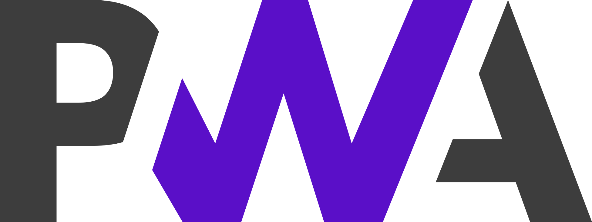
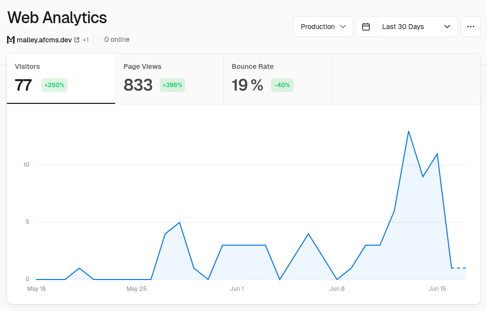
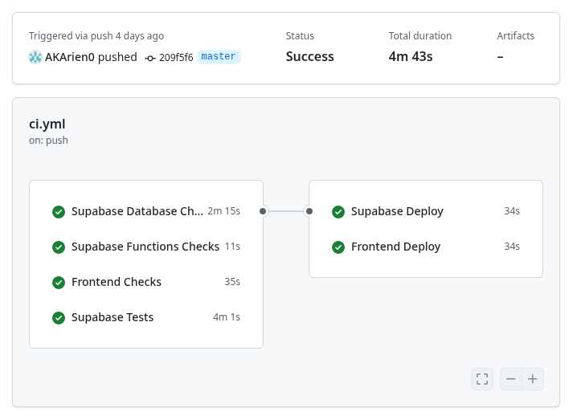
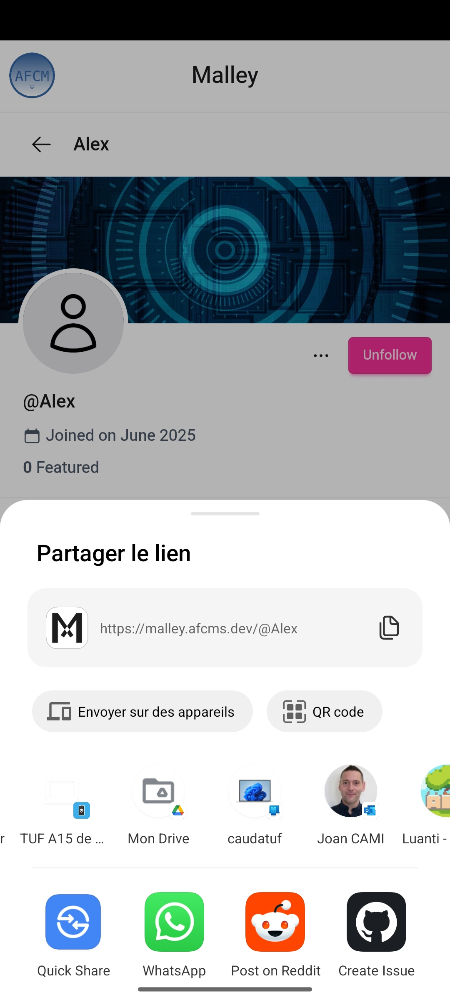
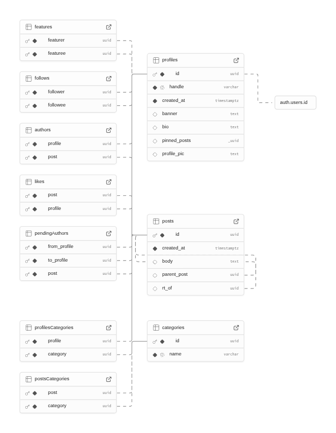

# Malley

Une plateforme de réseau social sur le modèle d'X

---

## L'équipe

  

    
    
Louis WALTER

    
Infra & Frontend

    

      <a href="https://github.com/AFCMS" target="_blank">
        
        @AFCMS
      </a>
    

  

  

    
    
Émilien DESSARPS

    
Backend & Optimisation

    

      <a href="https://github.com/AKArien0" target="_blank">
        
        @AKArien0
      </a>
    

  

  

    
    
Raphaël MALET

    
Frontend & Business

    

      <a href="https://github.com/Roceann" target="_blank">
        
        @Roceann
      </a>
    

  

---

## Présentation du produit

  

    
📱

    
Feed personnalisé

  

  

    
⭐

    
Mise en avant

  

  

    
👆

    
Système de swipe
    

  

  

    
🤝

    
Co-auteurs

  

Connexions par centres d'intérêt

---

## Valeur commerciale

  

    

      
🎯

      
Différenciation

    

    <ul class="value-list">
      <li>Relations follow/feature</li>
      <li>Catégorisation intelligente</li>
      <li>Co-création collaborative</li>
    </ul>
  

  

    

      
🚀

      
Innovation

    

    <ul class="value-list">
      <li>Gestion multi-auteurs</li>
      <li>Système d'invitations</li>
      <li>Architecture cloud native</li>
    </ul>
  

  

    
🔗 Écosystème d'interactions uniques

  

---

## Architecture

  

    
    
Supabase Cloud

    
Backend-as-a-Service

  

  
↔

  

    
    
Vercel

    
Frontend SPA

  

  <strong>Moderne, Scalable & développement facile</strong>

---

## Technologies

  

    
    
React 19

    
Interface utilisateur moderne

  

  

    
    
TypeScript

    
Typage statique & robustesse

  

  

    
    
TailwindCSS

    
Avec daisyUI pour un CSS moderne et cohérent

  

  

    
    
PWA

    
Expérience proche d'une application native, pour une fraction de la complexité

  

<strong>Stack moderne pour une expérience utilisateur optimale</strong>

---

## Supabase Cloud

- Authentification et gestion des utilisateurs (OAuth2, mail, etc)
- Base de données PostgreSQL hébergée
  - Système de migrations intégré
  - API RESTful et GraphQL
  - Accès direct depuis le frontend, sécurisé par des politiques Row Level Security (RLS)
- Stockage de fichiers médias via buckets S3-compatibles
- Edge Functions Typescript pour la logique métier

---

## Vercel

- Hébergement des fichiers front statiques
- Déploiement simple
- Analytics et monitoring intégrés

---

## CI/CD

Depuis le début, un système de CI/CD **GitHub Actions** a été mis en place pour automatiser les tests et le déploiement de l'application.

---

## PWA

La plateforme est une **PWA** (Progressive Web App), permettant une expérience utilisateur fluide et rapide, similaire à une application native.

Les fonctionalités comme le partage natif sont supportées.

---

## Base de données

---

## Base de données

- 3 entités : posts, profils et catégories
- Catégorisation
- Relations entre posts et profils

---

## Base de données

### Représentation des concepts

- Co-auteurs : requiert le stockage des auteurs dans une table
- Stockage des invitations dans une autre table
- Catégories : une table de stockage des catégories, deux tables de relations
- Les autres concepts sont représentés par une table

---

## Automatismes et programmations

- Programation Cron utilisée pour rafraîchir la vue matérialisée (estimations d’usage de catégories)
- Fonctions de DB et edge functions
- Divers triggers sont utilisées pour assurer un respect de contraintes complexes

---

## Sécurité : RLS

- Sécurité et intégrité des données assurée par des Row Level Security Policies
- RLS : Clauses « where » ajoutées à la requête par le serveur
- Zero trust : par défaut, tout est interdit
- Les politiques autorisent lecture / édition des données selon des conditions précises

---

## Tests

- Tests disponibles pour assurer le bon fonctionnement de la base de données après modifications
- Cibles séléctionnées par variables d’environnement
- Tests assurant un fonctionnement minimal est respecté
- Tests assurant le bon fonctionnement des politiques RLS

---

## Pistes d'amélioration

- Support de la traduction de la plateforme ([Lingui](https://lingui.dev) or [i18next](https://i18next.com))
- Algos de recommendation/recherche avancés (IA et [Supabase Vector](https://supabase.com/modules/vector))
- Plus d'intégration native pour la PWA
