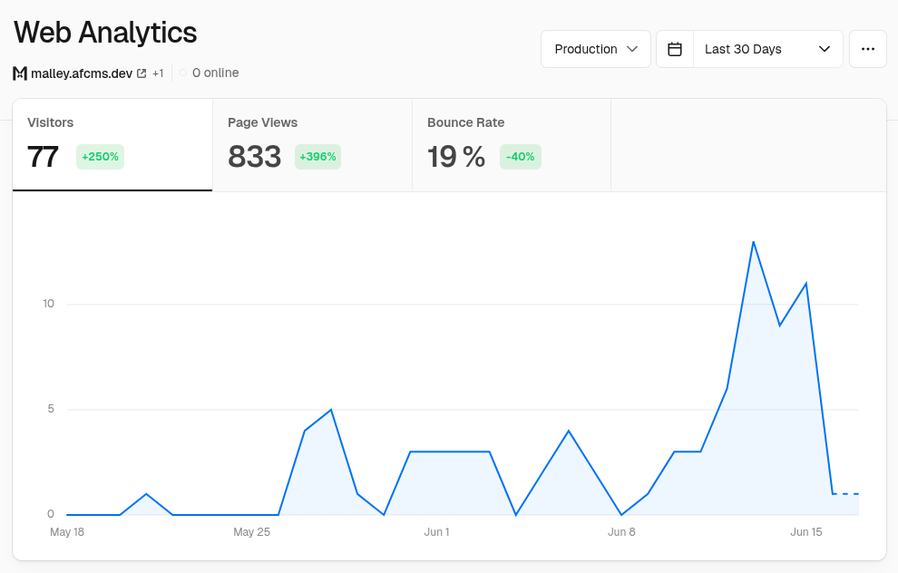
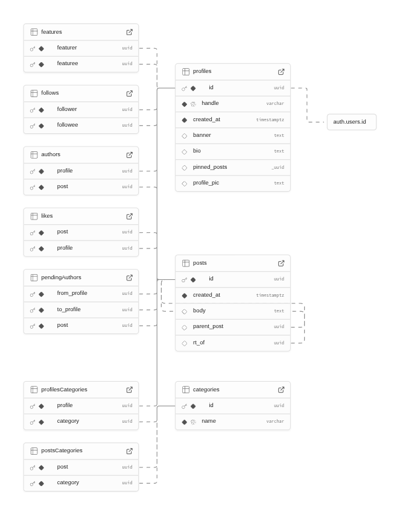

# Malley

Une plateforme de réseau social sur le modèle d'X

---

## L'équipe

  

    
    
Louis WALTER

    
Infra & Frontend

    

      <a href="https://github.com/AFCMS" target="_blank">
        
        @AFCMS
      </a>
    

  

  

    
    
Émilien DESSARPS

    
Backend & Optimisation

    

      <a href="https://github.com/AKArien0" target="_blank">
        
        @AKArien0
      </a>
    

  

  

    
    
Raphaël MALET

    
Frontend & Business

    

      <a href="https://github.com/Roceann" target="_blank">
        
        @Roceann
      </a>
    

  

---

# 🌟 Malley

  

    
📱

    
Feed personnalisé

  

  

    
⭐

    
Utilisateurs vedettes

  

  

    
👆

    
Système de glissement

  

  

    
🤝

    
Co-auteurs

  

Connexions par centres d'intérêt

# 💼 Valeur commerciale

  

    
✨ Différenciation

    <ul class="item-list">
      <li>Découverte intelligente</li>
      <li>Catégorisation des contenus</li>
      <li>Co-création de contenu</li>
      <li>Interactions personnalisées</li>
    </ul>
  

🔗 Écosystème d'interactions uniques

---

## Architecture

  

    
    
Supabase Cloud

    
Backend-as-a-Service

  

  
  
↔

  
  

    
    
Vercel

    
Frontend SPA

  

  <strong>Moderne, Scalable & développement facile</strong>

---

## Technologies

  

    
    
React 19

    
Interface utilisateur moderne

  

  
  

    
    
TypeScript

    
Typage statique & robustesse

  

  
  

    
    
TailwindCSS

    
Avec daisyUI pour un CSS moderne et cohérent

  

  
  

    
    
PWA

    
Expérience proche d'une application native, pour une fraction de la complexité

  

<strong>Stack moderne pour une expérience utilisateur optimale</strong>

## Concepts

- 3 entités : posts, profiles et catégories
- Multiples auteurs par post
- Posts et profils sont rattachés aux mêmes catégories

---

## Concepts - relations posts-posts

- Post parent : permet de faire des réponses
- Partage : analogue aux « Retweets », marque un post de référence

---

## Concepts - relations profils-profils

- Follow : une relation secrète, seul l’utilisateur qui la formule la connaît. Devrait être utilisée pour les feeds des utilisateurs.
- Feature : une relation affichée. Est montrée sur le profil public, et les relations réciproques sont soulignées.

---

## Concepts - auteurs et co-signage

- Auteur : de multiples utilisateurs peuvent être co-signataires d’un post. Ils partagent les droits d’édition
- Invitations de co-signage : un utilisateur peut en inviter un autre à co-signer son post.
- Un utilisateur peut abandonner la propriété d’un post
- Lorsqu’un post n’a plus d’auteurs, il est supprimé

---

## Supabase Cloud

- Authentification et gestion des utilisateurs (OAuth2, mail, etc)
- Base de données PostgreSQL hébergée
  - Système de migrations intégré
  - API RESTful et GraphQL
  - Accès direct depuis le frontend, sécurisé par des politiques Row Level Security (RLS)
- Stockage de fichiers médias via buckets S3-compatibles
- Edge Functions Typescript pour la logique métier

---

## Vercel

- Hébergement des fichiers front statiques
- Déploiement simple
- Analytics et monitoring intégrés

---

## CI/CD

Depuis le début, un système de CI/CD **GitHub Actions** a été mis en place pour automatiser les tests et le déploiement de l'application.

---

## Frontend TODO

TODO

---

## Backend

- Supabase-As-A-Backend
- Communication directe entre Supabase et le front
- Restrictions appliquées par Supabase
- Librairie client
- Typage assuré par Typescript / l’intégration de Typescript de Supabase / la CI
  
---

## Base de données

- 3 entités : posts, profils et catégories
- Catégorisation
- Relations entre posts et profils

---

## Base de données

---

## Représentation des concepts

- Co-auteurs : requiert le stockage des auteurs dans une table
- Stockage des invitations dans une autre table
- Catégories : une table de stockage des catégories, deux tables de relations
- Les autres concepts sont représentés par une table

---

## Automatismes et programmations

- Programation Cron est utilisée pour rafraîchir la vue matérialisée (estimations d’usage de catégories)
- Divers triggers et fonctions sont utilisées pour assurer un respect de contraintes complexes.

---

## Sécurité : RLS

- Sécurité et intégrité des données assurée par des Row Level Security Policies
- RLS : Clauses « where » ajoutées à la requête par le serveur
- Zero trust : par défaut, tout est interdit
- Les politiques autorisent lecture / édition des données selon des conditions précises

---

## Tests

- Tests disponibles pour assurer le bon fonctionnement de la base de données après modifications
- Cibles séléctionnées par variables d’environnement
- Tests assurant un fonctionnement minimal est respecté
- Tests assurant le bon fonctionnement des politiques RLS
