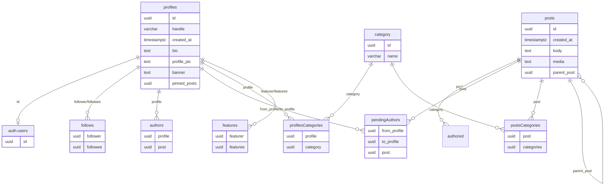

# Glossary
- anon
  - a supabase role. Anon applies to everyone which means users that are not logged in and is unpriviledged
- service
  - the other default supabase role. It is infinitely priviledged, thus, BE FRICKKING CAREFUL

# Structure

The database looks a bit weird at first. This is because it was built with rather specific constraints in mind for a few features we really wanted, notably :
- Co-authoring
- Tagging of users and posts

Row Level Security Policies :
- profiles
  - the user alone controls their profile and can edit it
  - there are a few contraints. Notably, a trigger runs to limit the pinned posts array size to 10
- posts
  - posts are controlled by users who have authorship, signified by the presence of an entry in the « authors » table referencing the user’s and the post’s uuid.
  - to make a new post, the client calls the createPost edge function. It handles all insersions and logic as service.
  - files are attached with the post-media bucket. The files are in a directory named after the uuid of the post as part of the upload procedure and cannot be changed. For restrictions and security, refer to the [storage]{#Storage} section.
  - the `parent_post` is a post this refers to. One might call this a reply, and this is the intended use.
- authors
  - no user can directly make an insertion
  - upon posting, the user gets attributed authorship of the post by the createPost edge function.
  - afterwards, the author can send co-authoring requests by inserting into the pendingAuthors table, and those can be accepted by calling the `accept_co_authoring` database function.
  - a post is deleted when every author gives up authorship of the it, with the `enforce_remove_authorless_posts` trigger
- pendingAuthors
  - the previously mentionned table that holds the authoring requests. Existing authors send requests by inserting a row with their own uuid as the « from_profile ». Any requests that do not comply are blocked.
  - to refuse (reciever) or cancel (sender), both parties have deletion access. In case the request is accepted, deletion of the record is handled by the `accept_co_authoring` function.
- categories
  - fundamentally, posts and users get the same tags/categories applied to them. All categorising is readable by anon
  - the clients « request » a category to exist for a name with the `id_of_ensured_category` function. If there is no category with this name, it is created, and a valid id is always returned to the client. Note that in the client library `supabase.ts`, the category adding functions take as argument the *name* of the category and call `queries.categories.idOfEnsuredCategory` internally.
- profilesCategories
  - applies categories to users. Writeable to by the user themselves and readable by anon
- postsCategories
  - applies categories to posts. Writeable to by the authors of a post and readable by anon
- features
  - a user that another user showcases from their own profile. The current front-end makes a special case of these relations being reciprocated, but the entries in that table are uni-directionnal.
  - writeable to by the `featurer` and readable by anon
- follows
  - used for the user’s feed and classic « social media follows » purposes.
  - readable and writeable to by the `follower`. Other users do not get to read.
- auth-users
  - the internal supabase auth tables. Profiles are linked to an entry in this table for authentification.

Mermaid js schema of the database :

# Storage

### post-media

Any user can read this bucket. No user can write into this bucket. Writes are done by service, in the createPost edge function.
The bucket contains directories that are named the uuid of the post of which they contain the media of. Items are named numerically.

### profile-pics / banners

Both buckets are readable by any user and authenticated users can upload a file that starts with their uuid (for caching reasons).
Users can only have one associated file at a time.
