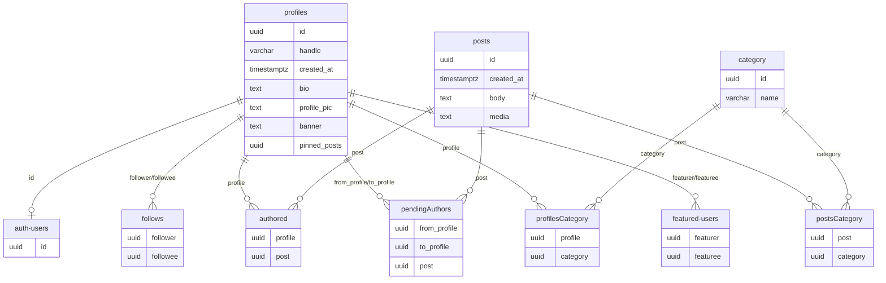

WIP, expect some more complete documentation in the coming days, or call me out to do it if i haven’t.

Mermaid js schema of the database :

```mermaid
erDiagram
    profiles {
        uuid id
        varchar handle
        timestamptz created_at
        text bio
        text profile_pic
        text banner
        uuid pinned_posts
    }

    posts {
        uuid id
        timestamptz created_at
        text body
        text media
    }

    category {
        uuid id
        varchar name
    }

    follows {
        uuid follower
        uuid followee
    }

    authored {
        uuid profile
        uuid post
    }

    pendingAuthors {
        uuid from_profile
        uuid to_profile
        uuid post
    }

    featured-users {
        uuid featurer
        uuid featuree
    }

    profilesCategory {
        uuid profile
        uuid category
    }

    postsCategory {
        uuid post
        uuid category
    }

    auth-users {
        uuid id
    }

    profiles ||--o| auth-users : "id"
    profiles ||--o{ follows : "follower/followee"
    profiles ||--o{ authored : "profile"
    profiles ||--o{ pendingAuthors : "from_profile/to_profile"
    profiles ||--o{ profilesCategory : "profile"

    posts ||--o{ authored : "post"
    posts ||--o{ pendingAuthors : "post"
    posts ||--o{ postsCategory : "post"

    category ||--o{ profilesCategory : "category"
    category ||--o{ postsCategory : "category"

    profiles ||--o{ featured-users : "featurer/featuree"
```
