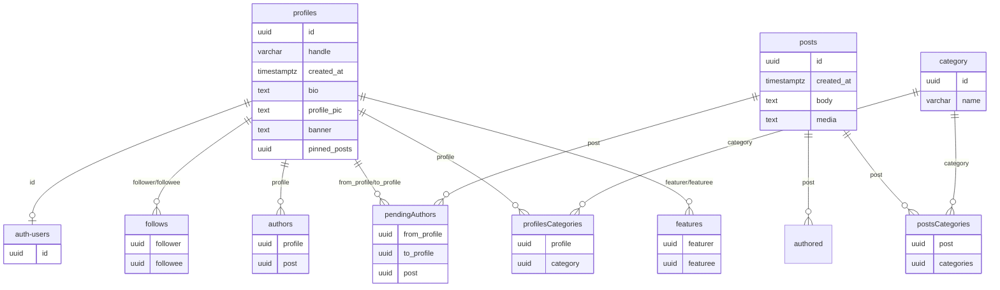

# Structure

The database looks a bit weird at first. This is because it was built with rather specific constraints in mind for a few features we really wanted, notably :
- Co-authoring
- Tagging of users and posts

Row Level Security Policies are mostly self-explanatory. For the rest :
- authors
  - no user can directly make an insertion
  - upon posting, the user gets attributed authorship of the post through the `enforce_make_poster_first_author` trigger.
  - afterwards, the author can send co-authoring requests by inserting into the pendingAuthors table, and those can be accepted by calling the `accept_co_authoring` database function.
  - a post is deleted when every author gives up authorship of the it, with the `enforce_remove_authorless_posts` trigger
- categories
  - fundamentally, posts and users get the same tags/categories applied to them
  - the clients should « request » a category id for the name it wants throught the `id_of_ensured_category` function. If there is no category with this name, it is created, and a valid id is always returned to the client.
  - `postsCategories` and `profileCategories` apply those categories

Mermaid js schema of the database :

```mermaid
erDiagram
    profiles {
        uuid id
        varchar handle
        timestamptz created_at
        text bio
        text profile_pic
        text banner
        uuid pinned_posts
    }

    posts {
        uuid id
        timestamptz created_at
        text body
        text media
    }

    category {
        uuid id
        varchar name
    }

    follows {
        uuid follower
        uuid followee
    }

    authors {
        uuid profile
        uuid post
    }

    pendingAuthors {
        uuid from_profile
        uuid to_profile
        uuid post
    }

    features {
        uuid featurer
        uuid featuree
    }

    profilesCategories {
        uuid profile
        uuid category
    }

    postsCategories {
        uuid post
        uuid categories
    }

    auth-users {
        uuid id
    }

    profiles ||--o| auth-users : "id"
    profiles ||--o{ follows : "follower/followee"
    profiles ||--o{ authors : "profile"
    profiles ||--o{ pendingAuthors : "from_profile/to_profile"
    profiles ||--o{ profilesCategories : "profile"

    posts ||--o{ authored : "post"
    posts ||--o{ pendingAuthors : "post"
    posts ||--o{ postsCategories : "post"

    category ||--o{ profilesCategories : "category"
    category ||--o{ postsCategories : "category"

    profiles ||--o{ features : "featurer/featuree"
```
